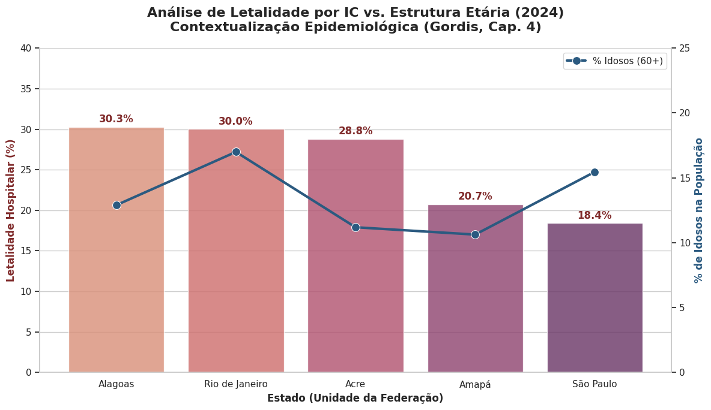

# Hospital Efficiency & Clinical Outcomes: Analysis of Heart Failure Lethality in Brazil (2024)
## 🩺 Clinical Context
In Brazil, Heart Failure (HF) is a leading cause of hospitalization and a major public health burden. While treatment protocols are well-established, in-hospital lethality remains a proxy for healthcare quality and system efficiency. This project evaluates the Hospital Lethality Rate: the ratio between hospital deaths and total admissions across all Brazilian states in 2024, identifying where the system fails to save patients once they are admitted.

## 📊 Key Analytical Insights
### 1. The Demographic "Confounding Factor" (Gordis, Cap. 4)
A critical discovery was made by crossing lethality with population age structure:
* **The Alagoas Red Flag:** Alagoas recorded high lethality (~30%) despite having a significantly **younger population** (only 12.8% seniors). This identifies a critical hotspot for healthcare efficiency.
* **The Rio de Janeiro Paradox:** While RJ also has high lethality (~30%), it has the highest percentage of seniors (16.9% aged 60+). According to the **Gordis methodology**, this suggests the rate is partially contextualized by a more fragile patient profile.
 

  

   ### 2. Efficiency Benchmark: SP vs. RJ
Despite similar urban complexities and aging populations, **São Paulo (15.4% seniors)** maintained a lethality rate of **18.4%**, nearly half of Rio's. This suggests that resource management in SP is more effective at decoupling aging from mortality.
### 3. Data Integrity & Surveillance
Significant outliers in states like Espírito Santo suggest potential underreporting or SIH/SUS database delays, highlighting challenges for real-time epidemiological surveillance.

  

  The following visualization crosses lethality rates with the percentage of the senior population (60+). This allows us to distinguish between mortality caused by biological fragility (aging) and mortality potentially caused by healthcare system gaps.
  
## 🛠️ Technologies & Methodology
- Language: Python 3.x
- Data Libraries: * Pandas: Cleaning and processing administrative datasets, handling Brazilian-specific numerical formatting (thousands separators), and feature engineering (Lethality Coefficient calculation).
- Matplotlib: Time-series visualization and comparative analysis of state-level performance.
- Methodology: Calculation of monthly lethality coefficients
(Deaths/Admissions)∗100
and weighted annual means to identify geographic "hotspots" of hospital mortality.

## 📁 Data Source
The raw data was extracted from TABNET/DATASUS (Brazilian Ministry of Health), specifically from the Hospital Information System (SIH/SUS). The analysis includes:
- Total hospital admissions for Heart Failure (IC) per state.
- Total in-hospital deaths for Heart Failure (IC) per state.
- Monthly data coverage from January to December 2024.
